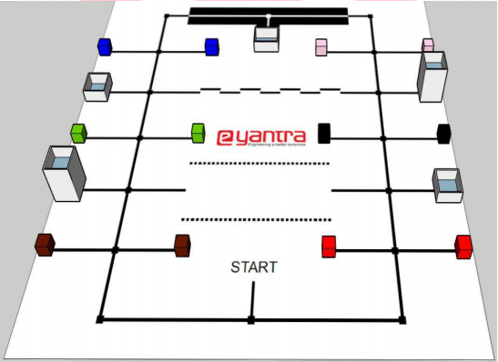

# Overview

This repository contains codes and documentation developed during E-Yantra Robotics Competition 2019 - 2020 for the theme 'Construct-O-Bot'.
* Team ID: eYRC#3302
* Members: Saurav Pandey, Mishael Thomas, Ayush Pareek, Pulkit Sharma
* College: Bharati Vidyappeth's College Of Engineering, New Delhi.

## Description

Given Arena :

In this theme, the arena is an abstraction of a disaster site where the robot picks the construction material and traverses paths in order to deposit it at the site to be reconstructed. In order to maneuver over these paths, the Construct-O-Bot has to use intelligent line-following and path-planning algorithms to reach safely and quickly using shortest paths. After reaching the site, the Construct-O-Bot carefully has to place the material at the required positions which may include placing the material at different heights from the ground. It has to deposit all required material at multiple construction sites, navigating through various terrains.

__*Tech Stack: Building a Bot, V-Rep Simulation, Micro-controller Programming, Path Planning, C++*__

Our team was able to complete Stage-1 and partially complete Stage-2 (upto Task 3).

*Stage 1*: Implementing the given task using simulation. This includes Task 0 and Task 1.
  * *Task 0*: Installation and testing of necessary software (Visual Studio IDE and V-REP robot simulator).
  * *Task 1*: Using path planning, line following and wall following algorithms to complete the given task in shortest possible time.
  
*Stage 2*: This stage involves working with actual hardware to implement the solution developed before.
  * *Task 2*: Printing arena in a flex sheet and constructing blocks and houses as per rulebook. Hardware testing also needs to be done.
  * *Task 3*: Documentation of the developed solution.
  * *Task 4 and Task 5*: Using developed bot to implement path planning, line following and wall following algorithms and, complete the given task in shortest possible time.

Guidelines related to each task is given in *Read Me.pdf* file in every task's directory.
